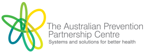
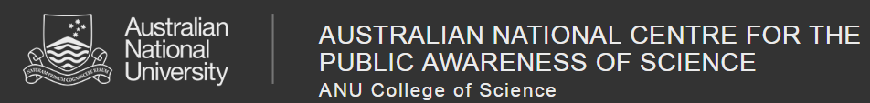

# Public Health Game
Add description here.

#### [Semester 1 Project Progress](Documentation/Semester_1/overview.md)

These are overviews of the artifacts we have produced, organised by sprint and audit. They contain quick access to our outputs, documentation, and meeting notes. 

## Table of Contents

1. [Team Members](#team-members)

2. [Tools and Services](#tools-and-services)

3. [Milestones](#milestones)

4. [Project Schedule](#project-schedule)

5. [Process Changes](#process-changes)

6. [Client's Vision](#clients-vision)

7. [Key Stakeholders](#key-stakeholders)

8. [Client and Stakeholder Expectations](#client-and-stakeholder-expectations)

9. [Project Impact](#project-impact)

10. [Technical and Other Constraints](#technical-and-other-constraints)

11. [Resources, Risks and Potential Costs](#resources-risks-and-potential-costs)

12. [NDA and IP Concerns](#nda-and-ip-concerns)

13. [References](#references)

## [Team Members](Documentation/)

## [Tools and Services]
**Team communications:** we use Slack for chatting. Slack is supper good community platform, it can easily organize our group and we can create different channel for specific job. Link is:  https://anupublichealth1.slack.com 

**Task management:** we use Trello for arranging tasks. We can list all the tasks on Trello board, all of our members can see all the tasks clearly. Link is: https://trello.com/b/sq2c54ek/tasks

**Project repository:** we use GitHub. Link is: https://github.com/anupublichealth/publichealth1

## [Milestones]
**Milestone 1: Game Prototype** 
Sprint 1 (Week 3 - Week 4) 
Look at example games, understand goal. 
Understand client's requirement.  
Design suitable game UI. 
Sprint 2 (Week 5 - Week 6) 
Start development for basic game part.  
**Milestone 2: Game Improvement** 
Sprint 3 (Week 7 - Week 8) 
Build connection between mobile and server 
Add additional functions like adviser. 
Sprint 4 (Week 9 - Week 10) 
Improve game performance. 
Set up final version of development. 
Prepare presentation.

## [Project Schedule]
**1. Understanding Requirements(1 week)** 
<ul>
  <li>Communicate with the clients and read the project introduction page to get a general impression of the project</li>
  <li>Discuss through group meeting</li>
  <li>Ask questions that we are confused and get a clear understanding of requirements</li>
</ul>

**2. Setup(3 days)** 
<ul>
  <li>Set up Github repository and add all the team members as colleborators</li>
  <li>Set up communication tools such as slack and trello</li>
  <li>Set up documentation share tools such as Google Drive</li>
  <li>Determine the leaders and roles</li>
  <li>Arrange meeting time</li>
</ul>

**3. Requirement Analysis(1 week)** 
<ul>
  <li>Analyse the time and cost of clients's requirements</li>
  <li>Determine what platform, programming languages and tools we should use</li>
</ul>

**4. Design(2 weeks)** 
<ul>
  <li>Do some research on health policies</li>
  <li>Refer to games that are similar to our game</li>
  <li>Design rules of the game and how to play</li>
  <li>Design the overall framework of the game</li>
  <li>Basic user interface(UI) design</li>
</ul>

**5. Coding(4 weeks)** 
<ul>
  <li>Build objects</li>
  <li>Link the game data to the DSMs provided</li>
  <li>Build database to record players' data</li>
  <li>UI coding</li>
</ul>

**6. Testing(2 weeks)** 
<ul>
  <li>Unit testing</li>
  <li>Integration testing</li>
  <li>System testing</li>
</ul>

**7. Deployment(2 weeks)**
## [Process Changes]

## [Client's Vision]
The client's vision is a fun multi-player mobile game about public health. The clients' objective for this game is to help players participate in and appreciate the health policy development. Players will act as an official who is responsible to public health. They will select, adapt and schedule policies and programs aiming to minimise the amount of disease and/or the inequitable distribution across the population. This game will simulate all the situations(like how health and economic outcomes change over time) due to different sequence of policy initiatives by the player. The clients also want the players to share their experiences with this game. All Above is our understanding of the client's vision. The client's vision is just a framework at this point. We will get into details by discussing with the clients next week.

## [Key Stakeholders]
Project Clients:
The Australian Prevention Partnership Centre (TAPPC, https://preventioncentre.org.au): 

National Centre for the Public Awareness of Science (CPAS. https://cpas.anu.edu.au):

Project Team: 
19-S1-2-C Public Health 1 of TechLauncher

## [Client and Stakeholder Expectations]
The client expects to have a multi-player mobile game, in which players act as a Health Minister and make decision to increase the health level of the public. The game should help the public get familiar with multiple health policies and understand the complexity of this kind of decision making. Further, the public would have more confidences in some policies the governments are shy of trying as a result of playing the game. Also the game should not be like a boring teaching presentation, but interactive and interesting enough so that players are willing to share their experience to others. 

Besides, the options of players should be record and demonstrated to the real-world decision maker in a proper way to help them make decision.

## [Project Impact]
This project will help the public have a better understanding of the content of health polices and the health and economic impact they have. As a result, they will be more confident in the policies that are currently adapted. Besides, the public will know how multiple factors influence the decision making, and we will understand the effort the governments have made for a good decision. When the public trust in their governments, the governments can also do more things than before. The governments will be more brave to try some new policies and the implementation of those policies will be easier as the public have know them well. 

Besides, this project will help the real-world decision know the public preferences for health policies better. This reduces the gap between decision maker and the public, so that more beneficial policies can be come up.

## [Technical and Other Constraints]

## [Resources, Risks and Potential Costs]

## [NDA and IP Concerns]
There will be no non-disclosure agreement required. 
Any materials, tools, methods/techniques and software provided by client
and/or advised and agreed to be client Copyright, will remain the intellectual
property of client.

## [References]
Bobby, M., Jack, H. & Gary, H., 2009. The “HealthBound” Policy Simulation Game: An Adventure in US Health Reform. Albuquerque, New Mexico, USA, International System Dynamics Conference.

BTN Pte Ltd, 2016. ‎Peak Oil 101 on the App Store. [Online] 
Available at: https://itunes.apple.com/sg/app/peak-oil-101/id1088199106

Centers for Disease Control and Prevention, 2008. Get in the Game to Redirect the U.S. Health System. [Online] 
Available at: https://www2.cdc.gov/syndemics/game.htm

