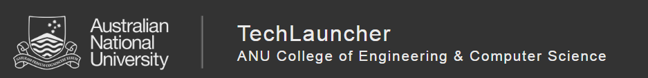

# Health Minister for a Day
A Multi-Player Mobile Game for Reducing Preventable Chronic Disease.

#### [Project Progress](Documentation/Semester_1/overview.md)

Overview of artifacts to be produced over the semester, organised by audits and sprints. They contain easy access to our outputs, documentation, and meeting notes. 

## Table of Contents

1. [Team Members](#team-members)

2. [Tools and Services](#tools-and-services)

3. [Key Stakeholders](#key-stakeholders)

4. [Client's Vision](#clients-vision)

5. [Milestones](#milestones)

6. [Project Schedule](#project-schedule)

7. [Client and Stakeholder Expectations](#client-and-stakeholder-expectations)

8. [Project Impact](#project-impact)

9. [Technical and Other Constraints](#technical-and-other-constraints)

10. [Resources, Risks and Potential Costs](#resources-risks-and-potential-costs)

11. [NDA and IP Concerns](#nda-and-ip-concerns)

12. [References](#references)

13. [Process Changes](#process-changes)

## Team Members

## Tools and Services
**Team communications:** Slack as main communication channel. Easily accessible by our team, stakeholders and our shadow team. Available at: https://anupublichealth1.slack.com 

**Task management:** Trello "Tasks" board is visibile to everyone. Available at: https://trello.com/b/sq2c54ek/tasks

**Project repository:** GitHub repository is available at: https://github.com/anupublichealth/publichealth1

## Key Stakeholders
Project Clients: 
The Australian Prevention Partnership Centre (TAPPC, https://preventioncentre.org.au): 

National Centre for the Public Awareness of Science (CPAS. https://cpas.anu.edu.au):

Project Team: 
19-S1-2-C Public Health 1 of TechLauncher

## Client's Vision
The client's vision is a fun multi-player mobile game about public health. The clients' objective for this game is to help players participate in and appreciate the health policy development. Players will act as an official who is responsible to public health. They will select, adapt and schedule policies and programs aiming to minimise the amount of disease and/or the inequitable distribution across the population. This game will simulate all the situations(like how health and economic outcomes change over time) due to different sequence of policy initiatives by the player. The clients also want the players to share their experiences with this game. All Above is our understanding of the client's vision. The client's vision is just a framework at this point. We will get into details by discussing with the clients next week.

## Milestones
**Milestone 1: Proof-of-Concept Prototyping** 
>**Sprint 0 (Week 2 Kick-off)** 
- Gather preliminary requirements and initialize project with proposed tools and services. 

>**Sprint 1 (Week 3 - Week 4)** 
- Research into games of similar genre to propose a clear idea of the project's direction. 
- Research into the project's design (art, sound, story, technical, storyboard, etc.). 

  Begin: 
  - UX/UI prototyping. 
  - Game prototyping. 
  - Preparation for user testing. 

>**Sprint 2 (Week 5 - Week 6)** 
- Review feedback and make changes to existing prototypes. 

  Continued: 
  - UX/UI prototyping. 
  - Game prototyping. 
  - User testing (again). 

>**Sprint 3 (Teaching Break)** 
- Review feedback from second stage of testing, making appropriate changes. 
- From prototyping to materialization of the proof-of-concept. 

**Milestone 2: QoL improvement and Deployment** 
>**Sprint 4 (Week 7 - Week 8)** 
- Build connection between mobile and server 
- Feature additions (backlog). 

>**Sprint 5 (Week 9 - Week 10)** 
- Performance enhancements and stability improvements. 
- Eventual deployment of service. 
- Preparation for post-deployment testing. 

## Project Schedule
**1. Understanding Requirements(Sprint 1 - 5)** 
<ul>
  <li>Communicate with the clients and read the project introduction page to get a general impression of the project.</li>
  <li>Discuss through group meeting.</li>
  <li>Actively engage in conversations with stakeholders to get a clear understanding of requirements.</li>
</ul>
* Time estimate is not specified as client requirements may change (and often will change) throughout the lifecycle of the project. 

**2. Setup(Sprint 0)** 
<ul>
  <li>Set up Github repository and invite all relevant stakeholders.</li>
  <li>Set up communication tools such as Slack and Trello.</li>
  <li>Set up documentation share tools such as Google Drive.</li>
  <li>Assign leadership roles and team divisions.</li>
  <li>Arrange meeting time.</li>
</ul>

**3. Requirement Analysis(Sprint 1, 2, 3)** 
<ul>
  <li>Analyse the time and cost of clients's requirements.</li>
  <li>Determine what platform, programming languages and tools we should use.</li>
</ul>

**4. Design(Sprint 2, 3, 4)** 
<ul>
  <li>Do some research on health policies.</li>
  <li>Refer to games that are similar to our game.</li>
  <li>Design rules of the game and how to play.</li>
  <li>Design the overall framework of the game.</li>
  <li>Basic user interface(UI) design.</li>
</ul>

**5. Coding(Sprint 2, 3, 4, 5)** 
<ul>
  <li>Build objects</li>
  <li>Link the game data to the DSMs provided.</li>
  <li>Build database to record players' data.</li>
  <li>UI coding.</li>
</ul>

**6. Testing(Sprint 1, 2, 5)** 
<ul>
  <li>Unit testing</li>
  <li>Integration testing</li>
  <li>System testing</li>
</ul>

**7. Deployment(Sprint 5)**
<ul>
  <li> TBD.</li>
</ul>

## Client and Stakeholder Expectations
The client expects to have a multi-player mobile game, in which players act as a Health Minister and make decision to increase the health level of the public. The game should help the public get familiar with multiple health policies and understand the complexity of this kind of decision making. Further, the public would have more confidences in some policies the governments are shy of trying as a result of playing the game. Also the game should not be like a boring teaching presentation, but interactive and interesting enough so that players are willing to share their experience to others. 

Besides, the options of players should be record and demonstrated to the real-world decision maker in a proper way to help them make decision.

## Project Impact
This project will help the public have a better understanding of the content of health polices and the health and economic impact they have. As a result, they will be more confident in the policies that are currently adapted. Besides, the public will know how multiple factors influence the decision making, and we will understand the effort the governments have made for a good decision. When the public trust in their governments, the governments can also do more things than before. The governments will be more brave to try some new policies and the implementation of those policies will be easier as the public have know them well. 

Besides, this project will help the real-world decision know the public preferences for health policies better. This reduces the gap between decision maker and the public, so that more beneficial policies can be come up.

## Technical and Other Constraints

The lack of experience and knowledge on game development in general. 3D development would introduce further complexities that the team (as of now) might not be able to handle, which may bring delays to our deliverables. Thus, 2D development is currently the preferred choice. Nevertheless, development in 3D could be a research topic for us to look into provided that we have the time for it. If at some point we might find 3D do-able, we might consider it as an eventual system upgrade/overhaul further down the road.

Furthermore, frequent collaboration and communication are needed between two project teams, and the passing of information between the teams can get complicated as there are many people involved. Thus, the teams have to pay extra attention to make sure the information is correctly delivered between two teams as well as within our team, so that everyone could get up-to-date information about what they need in a timely fashion, such that they could do the right thing even if a sudden change were to happen.

## Resources, Risks and Potential Costs

**Potential Costs of Deployment:** 
We have plans to investigate options for a suitable deployment platform for our game. At this stage, we will look into services that offer free trials to allow us to get a better picture of what we really need for our game further down the road. True costs of deploying the game will be revealed after deciding on a suitable platform. Since this involves funding, this process is placed onto the research backlog as we would have to further discuss with our client for potential funding opportunities.

**Risk:**  
Game development requires careful management and an active feedback loop.
Looking at recent failures of AAA video game studios, most notably F76^ and Ant^^, it is clear that even large corporations are prone to catastrophic failures, especially since they neglected testing their product prior to releasing to the public.

^ F76 was an unpolished, unrefined product release that relied on its customers to be Day 1 testers.
^^ Ant was a game developed over 5 years that brought false promises and game-breaking bugs on release. Similar to F76, it was released at an unpolished state, leaving its users dissatisfied.

With that said, we should learn from developers who constantly engage with their users and the community. The active feedback loop helps tremendously especially in feature additions, QoL improvements and bug fixing. Their developers have a public Trello board at: https://trello.com/b/yxoJrFgP/subnautica-development. It can be said that their engagement with the community inspired us to do the same, though at a significantly smaller scale.

## NDA and IP Concerns
A non-disclosure agreement is not necessary at this point in time. 
Any materials, tools, methods/techniques and services provided by client 
and/or advised and agreed to be client Copyright, will remain the intellectual
property of client.

## References
Bobby, M., Jack, H. & Gary, H., 2009. The “HealthBound” Policy Simulation Game: An Adventure in US Health Reform. Albuquerque, New Mexico, USA, International System Dynamics Conference.

BTN Pte Ltd, 2016. ‎Peak Oil 101 on the App Store. [Online] 
Available at: https://itunes.apple.com/sg/app/peak-oil-101/id1088199106

Centers for Disease Control and Prevention, 2008. Get in the Game to Redirect the U.S. Health System. [Online] 
Available at: https://www2.cdc.gov/syndemics/game.htm
